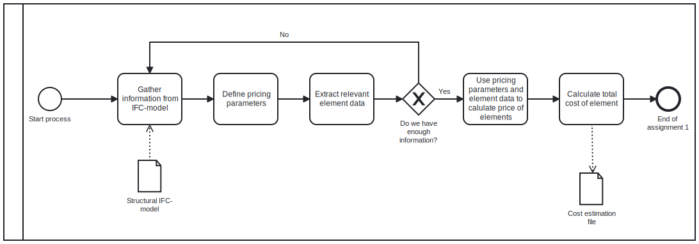

# A3 - Use case: Cost estimation
For Anders Træland and Nicklas Mikkelsen 

## 3A: Analyse use case  

1. Goal: To develop a script that identifies quantities and materials in order to calculate initial cost of the structural elements in a project. 

2. Model use (BIM uses): 

Our use case aim to estimate the cost of a project. Therefore, according to the "Mapping BIM uses, use cases and processes" in the "BIM Use Assignment" document, our use case (02: Cost estimation) falls underneath the following uses: 

- Gather: quantity 
- Analyse: forecast 

Since our use case digs into the structural elements of a project, it might also be interesting to look at "08: Structural Analysis":

Uses: 
- Analyse: forecast

# 3B: Proposed design for a tool/workflow 

3. In Assignment 1 we made a .bpmn file of or currrent use case. 

In this assignment we have updated the .bpmn file in order to cover the whole span of our use case. This bpmn is supposed to show the process from start to finish and is going to help clients to get a overview of the process.  

4. Description of the process of our tool: 

The first step of the process is for the client/contractor/user to agree on an intial budget for the structural building process in the project. Then they import a structural IFC-model and extract information from this model. Then it is useful to sort the model into different building storeys. The next step is to extract and sort IfcElements from each storey (i.e beams, columns, walls, slabs etc.). When this is done the user can find the dimensions and quantity of the selected elements (i.e volume of concrete in beams). From a .json-file they can import Molio Cost Data. If they still dont have enough information they should go back to the second step and extract more information from IFC-model. If they do have enough information they can continue by calculating the total cost for each storey and the total cost of the project based on the information they have. It is useful to export these result as a "cost estimation file". The next thing to do is to evaluate the result and decide on whether or not it is within the acceptance criteria of the budget. If it is not within the budget they can propose a new design that requires less materials. If so they should start the process all over again. If the client does not want to do this, they can reject the project. If it is within the budget they must decide if they want to proceed with the project, and if so continue with a detailed design and evaluation of the project. This marks the end of the initial cost estimation for structural elements in a building. 

# 3C: Information exchange 

5. Information exchange: We have filled out the information for our planned tool in the Excel template. Here we have specified the LOD for each element. Please see the Excel-file in the A3 respository. 

6. Describing the IFC entities and properties for the elements we identified in our information exchange. 

- Foundation ----> IfcFooting
- Floor      ----> IfcFloor 
- Slab       ----> IfcSlab
- Walls      ----> IfcWalls 
- Stairs     ----> IfcStairs 

We are also interested in finding the properties and cost of IfcBeams and IfcColumns, even though this is not mentioned in the Excel-file. 

# 3D: What is the potential improvement offered by this tool? 

7. Our Use Case offer value for business partners, employers and clients by providing early information about the cost in the start phase of a project. The cost analysis provides valuable information on whether or not the project is profitable. It limits unnecessary use of time and avoids negative results. We strongly believe that this could be a useful tool in the industry. 

8. Society will benefit in terms of more revenue, less unemployment and more tax money. If real estate companies, construction companies and other entrepreneurs benefit financially from a project, it means that they will have the funds to refinance and start on new projects. Again this could lead to a boost in employments. In short this is what we want to achieve with the Cost Estimation use case: increase the chance to make profit on projects, and hence provide more opportunities for both companies and workers.

# 3E - Delivery 

9. Description of how our tool/usecase can solve the Use Case: 

Our tool solves the use case by extracting data from IFC-files, analysing the relevant information and then producing a report that states the different cost in a project. This report can be used for many purposes but the most important is in this case to produce a cost estimation. 

10. 

First we would try to use the molio cost data in order to find the estimated prices for our materials and elements. We also use IfcOpenShell and find dimensions, materials and so on. We then want to make a code that estimates the cost of the project. This code should also be able to present the cost for different storeys, elements etc. though graphs. 